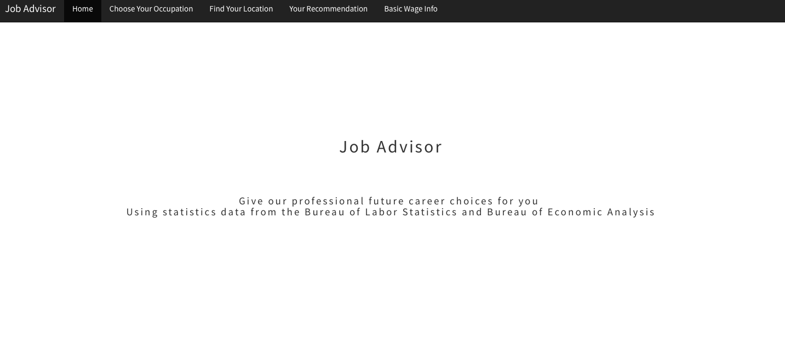
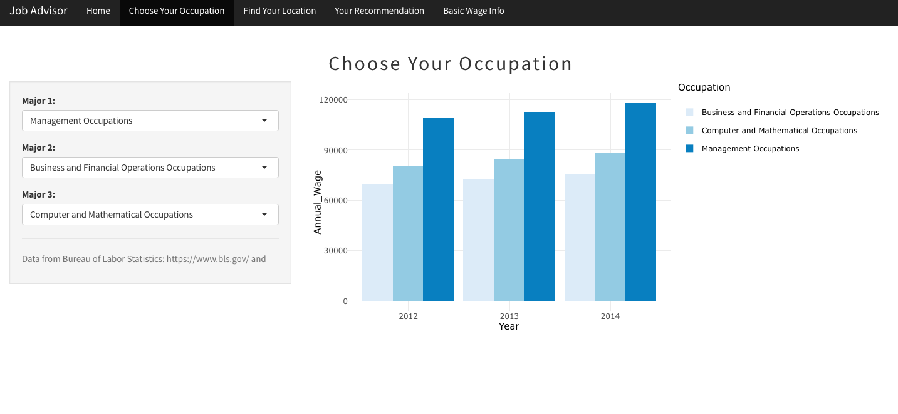
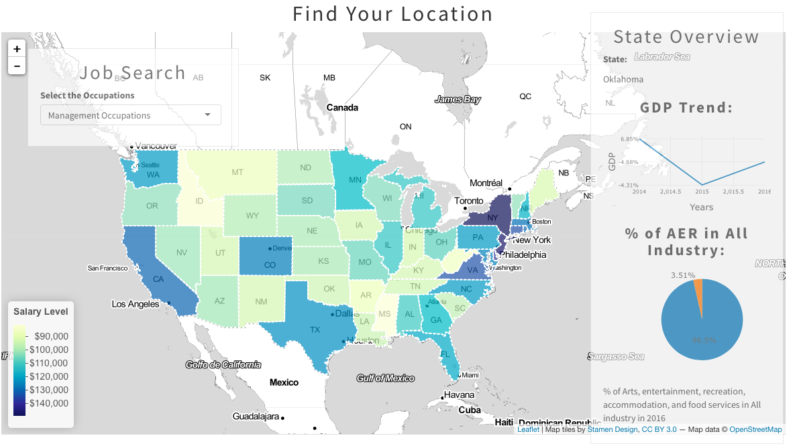
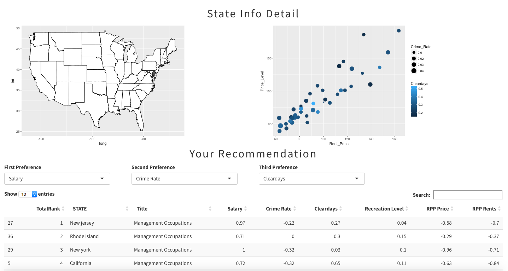

# Project 2: Open Data App - an RShiny app development project

###[Job Advisor_Group7](https://wenshan.shinyapps.io/jobadvisor/)






Term: Spring 2018

+ Group 7
+ **Job Advisor**: https://wenshan.shinyapps.io/jobadvisor/
+ Team Member:
	+ Wenshan Wang: ww2468@columbia.edu
	+ Junkai Zhang: jz2929@columbia.edu
	+ Sitong Chen: sc4283@columbia.edu
	+ Chenfei Jiang: cj2526@columbia.edu
	+ Jiaqi Dong: jd3418@columbia.edu

+ **Project summary**: In this project, we develop an app demo to help with future career choices using statistics provided by data.gov, ucr.fbi.gov, Bureau of Labor Statistics, and BEA. To give our professional future career choices, we integrate factors such as majors, salary, price level, crime rate, weather etc. that people may concern about while seeking jobs. Our app is divided into four main pages: Choose Your Occupation, Find Your Location, Your Recommedation, Basic wage info.
	+ Tab-Choose Your Occupation: This tab shows annual salaries of 22 different occupations in America. Users can choose one to three occupations and check those annual salaries in a bar plot.
	+ Tab-Find Your Location: This tab shows a salary distribution map. Users could choose an occupation to see how its salary distributes over 50 states. Also, a basic state information is provided when a certain state is clicked on.
	+ Tab-Your Recommedation: This tab offers job location recomendation for job seekers. Users could choose their top three preferences among variables such as salary, price level, crime rates, and climate. Based on users' occupation and preferences, we will recommend some job locations to users.
	+ Tab-Basic wage info: This tab show some basic information of wages among different states and occupations.
	


+ **Data Source**: We used data from data.gov, ucr.fbi.gov, Bureau of Labor Statistics, and BEA. For data detail, please kindly check our data folder.

+ **Contribution statement**: Wenshan Wang, Junkai Zhang, Sitong Chen, Chenfei Jiang and Jiaqi Dong brain-stormed the topic, designed the study and collected the data. 
Wenshan Wang, Junkai Zhang and Sitong Chen designed "Find Your Location" and "Your Recommendation". Chenfei Jiang and Jiaqi Dong designed "Choose Your Occupation" and "Basic Wage Info". Wenshan Wang and Junkai Zhang reorganized and commented on all UI, server and fixed bugs. Chenfei Jiang and Sitong Chen wrote readme file. Wenshan Wang checked all directories. All team members contributed to the GitHub repository and prepared the presentation. Jiaqi Dong gave the final presentation. All team members approve our work presented in our GitHub repository including this contribution statement.


Following [suggestions](http://nicercode.github.io/blog/2013-04-05-projects/) by [RICH FITZJOHN](http://nicercode.github.io/about/#Team) (@richfitz). This folder is orgarnized as follows.

```
proj/
????????? app/
????????? lib/
????????? data/
????????? doc/
????????? output/
```

Please see each subfolder for a README file.

